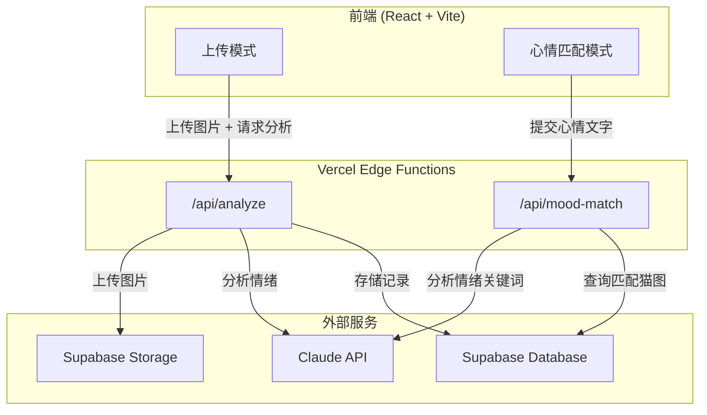

# Design Document: Cat Emotion Detector MVP

## Overview

本设计文档描述 cat-emotion-detector 的 MVP 核心功能实现方案，包含两个主要用户流程：

1. **内容生产端**：用户上传猫照片 → Claude AI 分析情绪 → 照片 + 情绪标签存入 Supabase
2. **内容消费端**：用户输入心情文字 → Claude 分析情绪关键词 → 从数据库匹配对应情绪的猫图 → 展示

技术栈：React + TypeScript + Vite + Tailwind CSS + Supabase + Claude API，部署于 Vercel Edge Functions。

### 设计决策

- **无用户认证**：MVP 阶段不需要用户登录，所有功能对匿名用户开放
- **标准化情绪标签**：使用固定的情绪标签枚举（happy, calm, sleepy, curious, annoyed, anxious），确保匹配准确性
- **Supabase Storage**：图片存储使用 Supabase Storage 的公开 bucket，简化 URL 管理
- **Vercel Edge Functions**：API 端点部署为 Edge Functions，保护 Claude API Key 不暴露到前端

## Architecture



### 数据流

**上传流程：**
1. 用户在前端选择猫照片文件
2. 前端验证文件格式（JPEG/PNG/WebP）和大小（≤10MB）
3. 前端将文件发送到 `/api/analyze`
4. Edge Function 将图片上传到 Supabase Storage，获取公开 URL
5. Edge Function 将图片（base64）发送给 Claude API 分析情绪
6. Edge Function 解析 Claude 返回的 JSON，提取 emotion_label 和 confidence
7. Edge Function 将 Cat_Record（image_url, emotion_label, confidence）存入 Supabase Database
8. 返回分析结果给前端展示

**心情匹配流程：**
1. 用户在前端输入心情描述文字
2. 前端将文字发送到 `/api/mood-match`
3. Edge Function 调用 Claude API 从文字中提取情绪关键词，映射到标准 Emotion_Label
4. Edge Function 从 Supabase Database 查询匹配该 Emotion_Label 的 Cat_Record
5. 随机选取最多 3 条记录返回给前端
6. 前端展示匹配的猫图和情绪标签

## Components and Interfaces

### 前端组件


```
src/
├── components/
│   ├── CatUploader.tsx        # 图片上传组件（文件选择、预览、提交）
│   ├── EmotionResult.tsx      # 情绪分析结果展示组件
│   ├── MoodInput.tsx          # 心情文字输入组件
│   ├── CatGallery.tsx         # 匹配猫图展示组件（卡片网格）
│   ├── ErrorMessage.tsx       # 统一错误提示组件
│   └── LoadingSpinner.tsx     # 加载状态组件
├── pages/
│   ├── UploadPage.tsx         # 上传模式页面
│   └── MoodMatchPage.tsx      # 心情匹配模式页面
├── lib/
│   ├── supabase.ts            # Supabase 客户端配置
│   ├── validators.ts          # 输入验证工具函数
│   └── types.ts               # TypeScript 类型定义
└── App.tsx                    # 路由和布局
```

#### CatUploader 组件

```typescript
interface CatUploaderProps {
  onUploadComplete: (result: AnalysisResult) => void;
  onError: (error: string) => void;
}
```

- 接受 JPEG/PNG/WebP 格式，最大 10MB
- 文件选择后显示预览
- 提交时显示加载状态，禁用重复提交
- 上传成功后回调 `onUploadComplete`

#### MoodInput 组件

```typescript
interface MoodInputProps {
  onMatchComplete: (result: MoodMatchResult) => void;
  onError: (error: string) => void;
}
```

- 文本输入框 + 提交按钮
- 空输入验证
- 提交时显示加载状态

#### CatGallery 组件

```typescript
interface CatGalleryProps {
  cats: CatRecord[];
  emotionLabel: EmotionLabel;
}
```

- 以卡片网格展示匹配的猫图（最多 3 张）
- 每张卡片显示图片和情绪标签

### API 端点

#### POST /api/analyze

改造现有端点，增加 Supabase 存储逻辑。

**Request:** `multipart/form-data` 包含图片文件

**Response:**
```typescript
interface AnalyzeResponse {
  success: boolean;
  data?: {
    image_url: string;
    emotion_label: EmotionLabel;
    confidence: number;
    description: string;
  };
  error?: string;
}
```

**处理流程：**
1. 验证文件格式和大小
2. 上传图片到 Supabase Storage
3. 将图片 base64 发送给 Claude API，使用结构化 prompt 要求返回 JSON
4. 解析 Claude 返回结果，验证 emotion_label 和 confidence
5. 存入 Supabase Database
6. 返回结果

#### POST /api/mood-match

新增端点。

**Request:**
```typescript
interface MoodMatchRequest {
  mood_text: string;
}
```

**Response:**
```typescript
interface MoodMatchResponse {
  success: boolean;
  data?: {
    emotion_label: EmotionLabel;
    cats: CatRecord[];
  };
  error?: string;
}
```

**处理流程：**
1. 验证 mood_text 非空
2. 调用 Claude API 分析情绪，映射到标准 EmotionLabel
3. 从 Supabase 查询匹配的 Cat_Record
4. 随机选取最多 3 条返回

### Claude API Prompt 设计

**情绪分析 Prompt（图片）：**
```
分析这张猫的照片，判断猫的情绪状态。
请以 JSON 格式返回：
{
  "emotion_label": "happy" | "calm" | "sleepy" | "curious" | "annoyed" | "anxious",
  "confidence": 0-100,
  "description": "简要描述猫的情绪状态"
}
只返回 JSON，不要其他内容。
```

**心情分析 Prompt（文字）：**
```
用户描述了自己的心情："${mood_text}"
请分析这段文字的情绪，并映射到以下猫的情绪标签之一：
happy, calm, sleepy, curious, annoyed, anxious
请以 JSON 格式返回：
{
  "emotion_label": "happy" | "calm" | "sleepy" | "curious" | "annoyed" | "anxious",
  "reasoning": "简要说明映射理由"
}
只返回 JSON，不要其他内容。
```

## Data Models

### TypeScript 类型定义

```typescript
// 标准化情绪标签枚举
type EmotionLabel = 'happy' | 'calm' | 'sleepy' | 'curious' | 'annoyed' | 'anxious';

// 数据库记录
interface CatRecord {
  id: string;           // UUID, 主键
  image_url: string;    // Supabase Storage 公开 URL
  emotion_label: EmotionLabel;
  confidence: number;   // 0-100
  description: string;  // AI 生成的简要描述
  created_at: string;   // ISO 8601 时间戳
}

// Claude API 图片分析返回
interface ClaudeAnalysisResult {
  emotion_label: EmotionLabel;
  confidence: number;
  description: string;
}

// Claude API 心情分析返回
interface ClaudeMoodResult {
  emotion_label: EmotionLabel;
  reasoning: string;
}

// 前端分析结果
interface AnalysisResult {
  image_url: string;
  emotion_label: EmotionLabel;
  confidence: number;
  description: string;
}

// 前端心情匹配结果
interface MoodMatchResult {
  emotion_label: EmotionLabel;
  cats: CatRecord[];
}
```

### Supabase Database Schema

```sql
-- cat_images 表
CREATE TABLE cat_images (
  id UUID DEFAULT gen_random_uuid() PRIMARY KEY,
  image_url TEXT NOT NULL,
  emotion_label TEXT NOT NULL CHECK (emotion_label IN ('happy', 'calm', 'sleepy', 'curious', 'annoyed', 'anxious')),
  confidence INTEGER NOT NULL CHECK (confidence >= 0 AND confidence <= 100),
  description TEXT NOT NULL DEFAULT '',
  created_at TIMESTAMPTZ DEFAULT now()
);

-- 按情绪标签查询的索引
CREATE INDEX idx_cat_images_emotion ON cat_images(emotion_label);
```

### Supabase Storage

- Bucket 名称：`cat-images`
- 访问策略：公开读取（Public bucket）
- 文件命名：`{timestamp}_{random}.{ext}`（避免冲突）
- 支持格式：JPEG, PNG, WebP

### 输入验证规则

| 字段 | 规则 |
|------|------|
| 图片格式 | JPEG, PNG, WebP（通过 MIME type 检查） |
| 图片大小 | ≤ 10MB |
| emotion_label | 必须是 6 个标准标签之一 |
| confidence | 整数，0-100 |
| mood_text | 非空，去除首尾空白后长度 > 0 |


## Correctness Properties

*A property is a characteristic or behavior that should hold true across all valid executions of a system — essentially, a formal statement about what the system should do. Properties serve as the bridge between human-readable specifications and machine-verifiable correctness guarantees.*

### Property 1: File validation accepts only valid format and size

*For any* file, the file validator should accept it if and only if its MIME type is one of `image/jpeg`, `image/png`, `image/webp` AND its size is ≤ 10MB. Any file failing either condition should be rejected with an appropriate error message.

**Validates: Requirements 1.2, 1.4**

### Property 2: Claude analysis response parsing extracts valid fields

*For any* valid JSON string containing `emotion_label`, `confidence`, and `description` fields, the analysis parser should extract an `emotion_label` that is one of the 6 standard labels, a `confidence` that is an integer between 0 and 100 inclusive, and a non-empty `description`. For any malformed JSON, the parser should return a default result without throwing.

**Validates: Requirements 2.2, 3.1, 3.3**

### Property 3: CatRecord serialization round-trip

*For any* valid CatRecord object, serializing it to the database format and deserializing it back should produce an object equivalent to the original (all fields preserved: id, image_url, emotion_label, confidence, description, created_at).

**Validates: Requirements 3.4**

### Property 4: Whitespace-only mood input is rejected

*For any* string composed entirely of whitespace characters (including the empty string), the mood input validator should reject it, and the system state should remain unchanged.

**Validates: Requirements 4.2**

### Property 5: Mood response parsing returns valid EmotionLabel

*For any* valid JSON string returned by Claude for mood analysis, the mood parser should extract an `emotion_label` that is one of the 6 standard labels (`happy`, `calm`, `sleepy`, `curious`, `annoyed`, `anxious`).

**Validates: Requirements 4.4**

### Property 6: Emotion query returns only matching records

*For any* valid EmotionLabel, querying the database should return only CatRecord entries whose `emotion_label` field exactly matches the queried label. No record with a different label should appear in the results.

**Validates: Requirements 5.1**

### Property 7: Random selection returns at most 3 items from source

*For any* list of CatRecord entries, the random selection function should return at most 3 items, and every returned item must be present in the original list. If the original list has ≤ 3 items, all should be returned.

**Validates: Requirements 5.2**

### Property 8: Error formatting produces user-friendly messages

*For any* Error object or error string, the error formatting function should produce a non-empty, user-friendly message that does not contain technical details such as stack traces, HTTP status codes, or raw exception names.

**Validates: Requirements 6.1**

## Error Handling

### 错误分类与处理策略

| 错误类型 | 触发条件 | 处理方式 | 用户提示 |
|---------|---------|---------|---------|
| 文件格式错误 | 非 JPEG/PNG/WebP | 前端拦截，不发请求 | "请上传 JPEG、PNG 或 WebP 格式的图片" |
| 文件过大 | > 10MB | 前端拦截，不发请求 | "图片大小不能超过 10MB" |
| 上传失败 | Supabase Storage 错误 | API 返回错误，不写数据库 | "图片上传失败，请稍后重试" |
| AI 分析失败 | Claude API 超时/错误 | API 返回错误，不写数据库 | "AI 分析暂时不可用，请稍后重试" |
| 解析失败 | Claude 返回非预期格式 | 使用默认值，记录警告日志 | 正常展示默认结果 |
| 心情输入为空 | 空字符串或纯空白 | 前端拦截，不发请求 | "请输入你的心情描述" |
| 心情分析失败 | Claude API 错误 | API 返回错误 | "心情分析暂时不可用，请稍后重试" |
| 无匹配猫图 | 数据库无对应标签记录 | 返回空数组 | "暂时没有匹配的猫图，试试其他心情描述吧" |
| 网络错误 | 网络连接中断 | 前端捕获 fetch 错误 | "网络连接失败，请检查网络后重试" |

### 错误处理原则

1. **前端优先验证**：文件格式、大小、空输入等在前端拦截，减少无效请求
2. **API 层兜底**：所有 API 端点包含 try-catch，确保不返回 500 错误
3. **不暴露技术细节**：错误消息使用用户友好的中文描述
4. **失败不写入**：任何步骤失败时，不将不完整数据写入数据库
5. **加载状态管理**：所有异步操作期间显示加载指示器，禁用提交按钮防止重复提交

### 错误格式化工具函数

```typescript
function formatUserError(error: unknown): string {
  if (error instanceof TypeError && error.message.includes('fetch')) {
    return '网络连接失败，请检查网络后重试';
  }
  if (error instanceof Error) {
    // 不暴露原始错误信息，返回通用提示
    return '操作失败，请稍后重试';
  }
  return '发生未知错误，请稍后重试';
}
```

## Testing Strategy

### 测试框架选择

- **单元测试**：Vitest（与 Vite 生态一致）
- **属性测试**：fast-check（TypeScript 生态最成熟的 PBT 库）
- **测试运行**：`vitest --run`（单次执行，非 watch 模式）

### 属性测试（Property-Based Testing）

每个 Correctness Property 对应一个属性测试，使用 fast-check 生成随机输入，最少运行 100 次迭代。

每个测试必须包含注释标签，格式为：
`// Feature: ui-enhancement-social-features, Property {number}: {property_text}`

**测试文件结构：**
```
src/
├── lib/
│   ├── validators.ts          # 验证逻辑
│   ├── parsers.ts             # 解析逻辑
│   ├── selectors.ts           # 选择逻辑
│   └── errors.ts              # 错误格式化
└── __tests__/
    ├── validators.property.test.ts   # Property 1, 4 的属性测试
    ├── parsers.property.test.ts      # Property 2, 5 的属性测试
    ├── serialization.property.test.ts # Property 3 的属性测试
    ├── query.property.test.ts        # Property 6 的属性测试
    ├── selectors.property.test.ts    # Property 7 的属性测试
    └── errors.property.test.ts       # Property 8 的属性测试
```

**属性测试示例（Property 1）：**
```typescript
// Feature: ui-enhancement-social-features, Property 1: File validation accepts only valid format and size
import * as fc from 'fast-check';
import { validateFile } from '../lib/validators';

describe('Property 1: File validation', () => {
  it('accepts valid files and rejects invalid ones', () => {
    const validMimeTypes = ['image/jpeg', 'image/png', 'image/webp'];
    const maxSize = 10 * 1024 * 1024; // 10MB

    fc.assert(
      fc.property(
        fc.record({
          mimeType: fc.oneof(
            fc.constantFrom(...validMimeTypes),
            fc.string().filter(s => !validMimeTypes.includes(s))
          ),
          size: fc.nat({ max: 20 * 1024 * 1024 }),
        }),
        ({ mimeType, size }) => {
          const result = validateFile({ type: mimeType, size } as File);
          const isValidType = validMimeTypes.includes(mimeType);
          const isValidSize = size <= maxSize;
          expect(result.valid).toBe(isValidType && isValidSize);
        }
      ),
      { numRuns: 100 }
    );
  });
});
```

### 单元测试

单元测试覆盖具体示例、边界情况和错误条件：

- **边界情况**：空文件、恰好 10MB 的文件、空字符串输入、纯空格输入
- **错误条件**：Claude API 返回畸形 JSON、网络超时、Supabase 存储失败
- **集成点**：API 端点的请求/响应格式验证
- **具体示例**：已知情绪标签的匹配、特定心情文字的解析

### 测试配置

```typescript
// vitest.config.ts
export default defineConfig({
  test: {
    globals: true,
    environment: 'jsdom',
    include: ['src/**/*.test.ts', 'src/**/*.property.test.ts'],
  },
});
```

### 测试覆盖目标

| 模块 | 单元测试 | 属性测试 |
|------|---------|---------|
| validators.ts | 边界值、错误格式 | Property 1, 4 |
| parsers.ts | 畸形 JSON、缺失字段 | Property 2, 5 |
| 序列化逻辑 | 特定 CatRecord 实例 | Property 3 |
| 数据库查询 | 空结果、单结果 | Property 6 |
| selectors.ts | 空列表、1-3 项列表 | Property 7 |
| errors.ts | 各类错误对象 | Property 8 |
